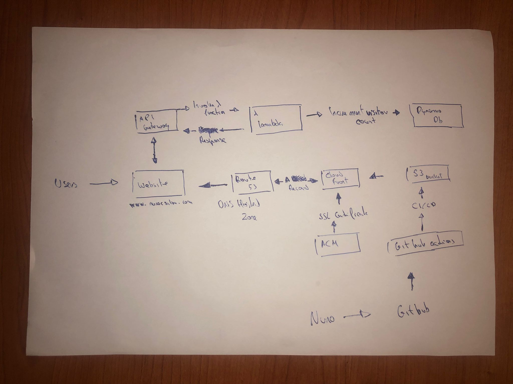

1. [Introduction](#introduction)
2. [Frontend](#frontend)
3. [S3](#s3)
4. [Route 53](#route-53)
5. [Cloudfront](#cloudfront)
6. [AWS Certificate Manager (ACM)](#aws-certificate-manager-acm)
7. [DynamoDb](#dynamodb)
8. [Lambda](#lambda)
9. [API Gateway](#api-gateway)
10. [Javascript](#javascript)
11. [CI/CD](#cicd)


## Introduction

* In this mini project we will host our Static website registered in Route53 in S3 and have the origin in a Cloudfront distribution.
* Also we will have a API Gateway, that every time we go to the website, will invoke a Lambda that will increment and retrieve the total count of visitors. We will be displaying the views in the homepage. 

1. Website: Code->GithubActions->S3->Cloudfront->Route53->Website
2. Count: Website->API Gateway->Lambda->DynamoDb


<p align="center"><strong>Project</strong></p>


Note: I registered nunocsilva.com in Route53.

## Frontend

Since Frontend wasn't the main focus of the project i took a free template from **https://javascript.plainenglish.io/** and made the necessary adjustments for the project.


## S3
 
1. Create bucket with same name as your registered domain (nunocsilva.com) 
2. Uncheck "Block public acess"
3. Go to properties and enable static website hosting
4. Add an index.html and a error.html
5. Go to permissions to create a bucket policy in order to be able to interact with your objects

Bucket policy:

```
{
  "Version": "2012-10-17",
  "Statement": [
    {
      "Sid": "PublicRead",
      "Effect": "Allow",
      "Principal": "*",
      "Action": ["s3:GetObject"],
      "Resource": ["arn:aws:s3:::your-bucket-name/*"]
    }
  ]
}
```
S3 Website Endpoint:

When you enable static web hosting on an S3 bucket, AWS assigns a unique website endpoint to that bucket. This endpoint allows you to access your static website directly from the S3 bucket 

 The URL of the website endpoint typically looks like this: "http://bucket-name.s3-website.region.amazonaws.com".

## Route 53

Go to the hosted zone of your domain:

* Create Record
* Routing policy -> Simple Routing
* Record type -> A
* Endpoint -> Alias to S3 website endpoint
* Region -> Same region as S3 bucket
* Select your bucket
 
Now you can acess your website through the bucket website endpoint


## Cloudfront

Cloudfront job is to cache objects from one or more origins, when creating a distribution we need to specify origin domain name.

Currently we have two problems:

1. Anyone outside the region where the bucket is, will have a suboptimal experience
2. We can't deliever the site using https -> data in not encrypted in transit


Cloudfront configuration:

* Choose origin domain name -> S3 bucket
* Alternate domain name -> www.nunocsilva.com
* Request certificate
* Viewer protocol policy -> redirect HTTP to HTTPS
* Default root object -> index.html

### Cache & Invalidations

When working with Edge Location, we might have update a file, and the content we deliever be outdated, this happens because what is being displayed is cached in the Edge Location. We can improve this with invalidations:

* Use absolute path for a specific file
* Use /* to invalidate everything, this way everytime we update something in our code, the content delievered will be direct from the origin


## AWS Certificate Manager (ACM)

### SSL certificate

In order to use https, we need a SSL certificate, and for that we will use ACM (AWS Certificate Manager)

* Request certificate:
    1. Request public certificate
    2. In fully qualified domain name put the domain you just picked -> this will be the domain to acess the distribution
    3. Validation method:
        * DNS validation -> we will be given a DNS record, that we need to add to our domain
        * Route53 will be able to query to check if the record is there, validating that you control the domain.
        * After request, open the certificate and click "Create record in Route 53", to create the CNAME record within
        * If we go to our domain in route 53 we can see the CNAME record there
    4. Go to your hosted zone in Route 53:
        * Create an A record
        * Simple routing
        * Record name -> same as the one we created the certificate for
        * Record type -> A
        * Endpoint -> Alias to Cloudfront distribution

Now we can acess https://www.nunocsilva.com, with this being loaded from Cloudfront using HTTPS, using a custom name and a custom SSL certificate


### Origin Access Control (OAC)

Restrict S3 origin to be only acessed by Cloudfront distribution:

1. Edit distribution
2. Select the S3 origin and clic Edit
3. In origin acess select **origin acess control settings** and click **create a control setting**
4. Copy the policy Cloudfront gives us to update the **S3 bucket policy**
5. This way, any acess direct to S3 will be denied, leaving only acess to be made through Cloudfront distribution

## DynamoDb

DynamoDb will store the value of visits to the website. Its a key-value pair database, very easy to setup, just change Read/write capacity settings to on-demand because provisioned is the default

Inserting in JSON:
```
{
  "id": {
    "S": "2"
  },
  "count": {
    "N": "0"
  }
}
```

* "S" represents a String attribute.
* "N" represents a Number attribute.

## Lambda

When someone visits the website, it will call an API throught API Gateway, that will invoke this lambda function, that has 2 jobs:

1. Increment the count in DynamoDb table in 1
2. Retrieve the incremented count so we can display it in homepage

Lambda is pretty straightfoward, i choosed python as Runtime and made a custom Role and Policy in order to acess DynamoDb.

Policy:
```{
    "Version": "2012-10-17",
    "Statement": [
        {
            "Effect": "Allow",
            "Action": [
                "dynamodb:GetItem",
                "dynamodb:PutItem",
                "dynamodb:UpdateItem",
                "dynamodb:DeleteItem"
            ],
            "Resource": "arn:aws:dynamodb:region::table/table-name"
        }
    ]
}
```

Now that we can acess our DynamoDb table we need to code our lambda function:

```
import boto3
import os
import json
from decimal import Decimal  # Import the Decimal class

def lambda_handler(event, context):
    
    # Create a connection to DynamoDB
    dynamodb = boto3.resource("dynamodb")
    
    # Get the name of the table from an environment variable
    table_name = os.environ["TABLE_NAME"]
    
    # Connect to the specific table in DynamoDB
    table = dynamodb.Table(table_name)

    # Get the current visit count from the database
    response = table.get_item(Key={"id": "website_visits"})
    
    # If the item exists in the table, get the current count
    if "Item" in response:
        visit_count = response["Item"]["count"]
    else:
        # If the item doesn't exist, it's the first visit, so set the count to 0
        visit_count = 0
    
    # Convert Decimal to int for serialization
    visit_count = int(visit_count)
    
    # Increment the visit count by 1 for each visit
    visit_count += 1
    
    # Update the new visit count in the table
    table.put_item(Item={"id": "website_visits", "count": visit_count})
    
    # Return the total visit count as the response
    return {
    'statusCode': 200,
    'headers': {
        'Access-Control-Allow-Origin': '*',
        'Access-Control-Allow-Headers': 'Content-Type',
        'Access-Control-Allow-Methods': 'OPTIONS,POST,GET'
    },
    'body': json.dumps({'total_visits': visit_count})
}
```

TABLE_NAME is stored in "Environment Variables" in "Configuration" as i find best to don't hardcode variable names

* Test - we can configure in Lambda interface a simple test just passing {} to see if we get the count from dynamodb

## API Gateway

The API Gateway will invoke the lambda function we just created:

1. Resource- can be thought of as the building blocks of your API's URL structure
2. In both **Methods** we will choose our lambda function:
    * POST -> to increment count in DynamoDb
    * GET -> to retrieve count

Whenever we save the Method API Gateway will ask us for permission to be able to invoke it. 

### CORS - Cross-Origin Resource Sharing

It is a security feature implemented in web browsers that controls how web pages from one domain are allowed to make requests to another domain.
This gave me a lot of work!!

Before we deploy the API we need to **Enable CORS**, i added all Gateway reponses. I was getting CORS errors and along the troubleshooting, i edited my S3 CORS configuration to allow some headers:

```
[
    {
        "AllowedHeaders": [
            "Content-Type"
        ],
        "AllowedMethods": [
            "POST",
            "GET",
            "PUT",
            "HEAD"
        ],
        "AllowedOrigins": [
            "*"
        ],
        "ExposeHeaders": []
    }
]
```
Now we can deploy our API and create a **Stage**.

Finally we get our **Invoke URL** that we can test against with tools like **Postman**
When testing don't forget to add the resource at the end
```
https://Invoke URL/Resource
```

### Javascript

If was my first time working with both Js and API's so this took me a long time.

My first glance of the answer came in Python:

```
import requests
import json

response = requests.get('https://coqh2vx627.execute-api.us-east-1.amazonaws.com/try1/counter')

count = response.json()['body']
print(count)
```
Since we can't inject Python in HTML i needed to convert this to JavaScript:

```
async function fetchVisitCount() {
    try {
        const response = await fetch('https://coqh2vx627.execute-api.us-east-1.amazonaws.com/try1/counter');
        const data = await response.json();
        const visitCount = JSON.parse(data.body).total_visits;

        const viewsElement = document.getElementById('views');
        viewsElement.textContent = `Views: ${visitCount}`;
    } catch (error) {
        console.error('Error fetching visit count:', error);
    }
}

fetchVisitCount();
```

In index.html just add:
```
<script src="counter.js"></script>
<a id="views">Views: Loading..</a>
```

## CI/CD

It would be painfull and prone to error, if everytime we make a change, we needed to add/change/delete the objects in our S3 bucket

So we can Automate this with Github Actions.

* Create in root of project a folder in root directory named **.github** inside that create **workflows**
```
.github/workflows/your yaml file for automation
```

Since want Github to have acess to your bucket but don't want to share our credentials (Never put your credentials where people can see it!).
Instead go to Setting in your repository, go to **Secrets and Variables** and set your secrets there.

My yml file:
```
name: Upload Website

on:
  push:
    branches:
      - master
      - main

jobs:
  deploy:
    runs-on: ubuntu-latest
    steps:
      - name: Checkout code
        uses: actions/checkout@v2

      - name: Configure AWS credentials
        run: |
          aws configure set aws_access_key_id ${{ secrets.AWS_ACCESS_KEY_ID }}
          aws configure set aws_secret_access_key ${{ secrets.AWS_SECRET_ACCESS_KEY }}
          aws configure set default.region us-east-1

      - name: Upload to S3
        run: |
          aws s3 sync web s3://${{ secrets.AWS_S3_BUCKET }} --delete --follow-symlinks

```